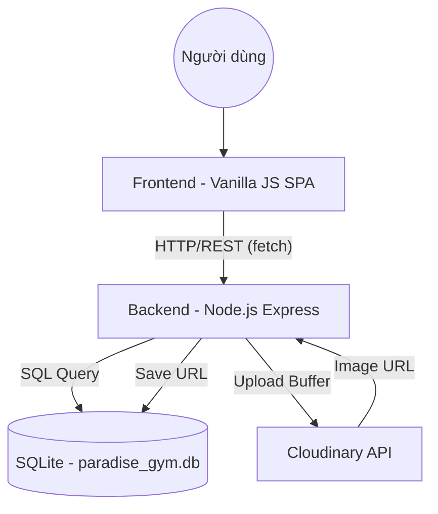

# 🏛️ Kiến Trúc Hệ Thống — Paradise GYM

> Cập nhật lần cuối: 08/05/2026 — Triển khai toàn bộ Backend Node.js và hợp nhất tài liệu kiến trúc Fullstack.

---

## 1. Tổng Quan Dự Án

- **Tên**: Paradise GYM Management System
- **Mục tiêu**: Hệ thống quản lý phòng gym toàn diện (Hội viên, PT, Gói tập, Lịch tập, Doanh thu).
- **Stack chính**: 
    - **Frontend**: HTML5, Vanilla JS (SPA), Tailwind CSS (Design System Material 3).
    - **Backend**: Node.js (ESM), Express.
    - **Database**: SQLite (better-sqlite3) + Cloudinary (Image Storage).

---

## 2. Sơ Đồ Kiến Trúc Tổng Thể

---

## 3. Các Thành Phần Hệ Thống

### 3.1. Frontend (SPA Architecture)
- **Vị trí**: `FE/`
- **Router**: `assets/js/app.js` — Quản lý chuyển view và điều hướng SPA.
- **Dữ liệu**: `assets/js/api.js` (Fetch wrapper) & `assets/js/auth.js` (Auth logic).
- **Styles**: `index.html` (Tailwind) & `assets/css/styles.css` — Custom Material 3 components.
- **Logic trang**: `assets/js/pages/*.js` — Các module chức năng riêng biệt.

### 3.2. Backend (REST API)
- **Vị trí**: `BE/`
- **Controller/Route**: Chia theo module nghiệp vụ (auth, members, packages, v.v.).
- **Middleware**:
    - `auth.js`: Xác thực JWT.
    - `role.js`: Phân quyền dựa trên `quyen_json`.
    - `upload.js`: Multer memory storage.
    - `audit.js`: Ghi nhật ký hành động nhạy cảm.

### 3.3. Database
- **Engine**: SQLite (tối ưu WAL mode cho hiệu năng cao).
- **Schema**: `paradise_gym_v2.sql`.
- **Triggers**: Tự động tính doanh thu và cập nhật trạng thái gói tập.

---

## 4. Cơ Sở Dữ Liệu (Bảng chính)

| Tên bảng | Mô tả |
|----------|-------|
| `tai_khoan` | Tài khoản đăng nhập (Hashed password). |
| `ho_so` | Thông tin cá nhân Hội viên / PT / Nhân viên. |
| `vai_tro` | Phân quyền hệ thống (JSON-based RBAC). |
| `goi_tap` | Danh mục gói tập phòng gym. |
| `dang_ky_goi_tap`| Lịch sử đăng ký và thanh toán của hội viên. |
| `lich_tap` | Chi tiết các buổi tập của hội viên với PT. |
| `doanh_thu` | Tổng hợp doanh thu tự động qua Triggers. |
| `audit_log` | Nhật ký thay đổi dữ liệu nhạy cảm. |

---

## 5. Danh Sách API Endpoints (Tóm tắt)

| Module | Endpoints | Chức năng chính |
|--------|-----------|-----------------|
| **Auth** | `/api/auth/login`, `/me`, `/doi-mat-khau` | Xác thực, phân quyền. |
| **Members** | `/api/members`, `/:id/package`, `/:id/avatar` | Quản lý hội viên, đăng ký gói. |
| **Trainers** | `/api/trainers`, `/:id/schedules` | Quản lý PT và lịch dạy. |
| **Checkins** | `/api/checkins`, `/stats` | Vào-ra, biểu đồ mật độ. |
| **Revenue** | `/api/revenue`, `/dashboard` | Thống kê doanh thu. |

---

## 6. Chức Năng Đã Hoàn Thành

### Frontend (UI/UX)
- [x] Giao diện SPA Material 3 (Glassmorphism).
- [x] Sidebar đóng/mở mượt mà, hỗ trợ Tooltip.
- [x] Dark/Light mode (Persistence).
- [x] Form thêm mới hội viên (>25 trường dữ liệu).
- [x] Bảng dữ liệu hỗ trợ Tìm kiếm không nháy (No-flicker).
- [x] 6 màn hình chức năng chính (Dashboard, Members, Checkin, Expired, PT, Packages).

### Backend (Logic & Security)
- [x] **Xác thực & Bảo mật**: JWT (7 ngày), Hash bcrypt, Khóa tài khoản sau 5 lần sai.
- [x] **Hội viên**: Quản lý hồ sơ, Đăng ký gói tập (tự động Den_ngay), Soft Delete.
- [x] **Hình ảnh**: Tích hợp Cloudinary (Upload/Xóa) cho Hội viên và PT.
- [x] **Gói tập**: Quản lý Gói Gym & Gói PT.
- [x] **Check-in**: Log vào/ra, Thống kê mật độ phục vụ biểu đồ Dashboard.
- [x] **PT Schedule**: Đặt lịch tập, Kiểm tra trùng lịch của PT, Xác nhận/Hủy buổi.
- [x] **Doanh thu**: Thống kê 30 ngày, Dashboard tổng quan (API JSON).
- [x] **Hệ thống**: Middleware RBAC (quyen_json), Audit Logging (ghi vết hành động).

### Tích hợp Fullstack (Kết nối FE-BE)
- [x] **API Wrapper**: Hoàn thiện `api.js` xử lý JWT tự động.
- [x] **Xác thực**: Trang Login kết nối API, bảo mật toàn bộ SPA.
- [x] **Dashboard**: Thống kê thực tế từ Database thay thế mock data.
- [x] **Hội viên**: Danh sách hội viên và PT lấy trực tiếp từ API.

---

## 7. Ghi Chú Kiến Trúc & Quyết Định Kỹ Thuật

- **07/05/2026**: Lựa chọn **Vanilla JS SPA** để tối ưu tốc độ load và không phụ thuộc framework nặng nề.
- **08/05/2026**: Sử dụng **better-sqlite3** để xử lý database đồng bộ, giúp code API sạch hơn và hiệu năng cao cho ứng dụng đơn luồng.
- **08/05/2026**: Triển khai **Memory Storage Multer** để bảo mật (không lưu file tạm) và tối ưu tốc độ upload lên Cloudinary.
- **08/05/2026**: Áp dụng **RBAC linh hoạt** qua cột `quyen_json`, cho phép thay đổi quyền hạn mà không cần sửa code middleware.
